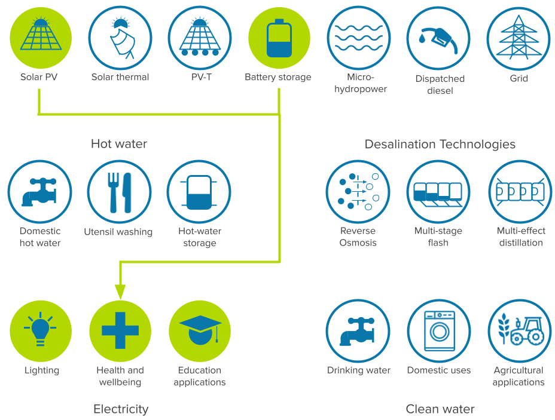

# CLOVER
CLOVER (Continuous Lifetime Optimisation of Variable Electricity Resources) is a an open-source Python based modelling framework enabling the simulation and optimisation of community-scale energy systems, typically minigrids, to support energy access in developing countries <a href="https://doi.org/10.21105/joss.04799" alt="Infographic of CLOVER workflow">[1]</a>. It is a framework under constant development, with new features being added, and has been applied to many different scenarios and case studies. (See the [publications page](publications.html) for more information.)

The model operates with an hourly resolution and is designed to be able to simulate or optimise community-scale energy systems over a multi-year timeframe. The model is modular, with solar electrcity, solar thermal, PVT, grid, diesel, and load modules. As an open-srouce repository, the development of new functionality is encouraged. For a list of open issues and feature requests see the [Github issues page](https://github.com/CLOVER-energy/clover/issues).

---

## About



## Cite us

You can cite the CLOVER-energy/CLOVER project by citing the following papers:
1. Winchester, B., Beath, H., Nelson, J., & Sandwell, P. (2023). CLOVER (Version v5.0.7) [Computer software]. [https://doi.org/10.5281/zenodo.6925535](https://doi.org/10.5281/zenodo.6925535)
2. Sandwell, P., Winchester, B., Beath, H., & Nelson, J. (2023). CLOVER: A modelling framework for sustainable community-scale energy systems. Journal of Open Source Software, 8(82), 4799, [https://doi.org/10.21105/joss.04799](https://doi.org/10.21105/joss.04799)
